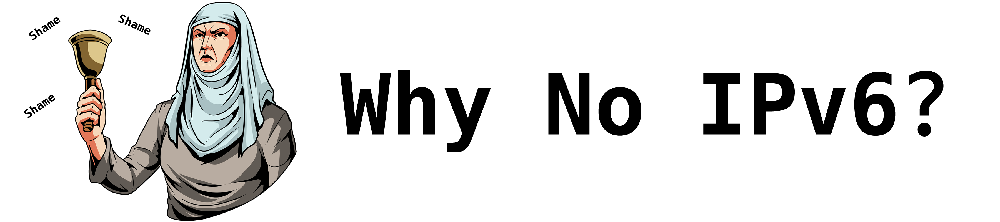
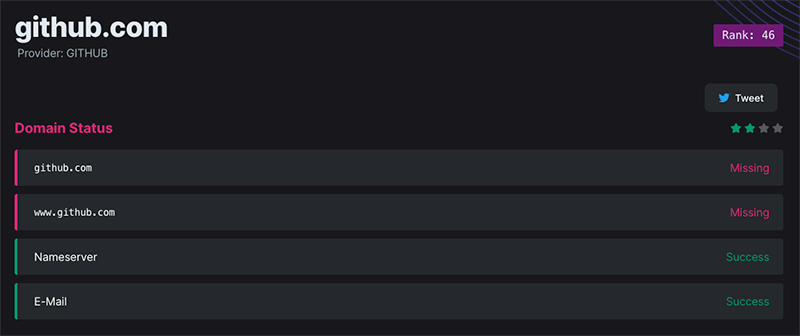

 

  <picture>
    <source media="(prefers-color-scheme: dark)" srcset=".github/images/Github-logo-white.png">
    
  </picture>

  

<h1 align="center">Shame as a Service</h1>

Shaming the largest websites in the world lacking IPv6 support.

 

    <a href="https://github.com/lasseh/whynoipv6/issues/new?assignees=&labels=bug&projects=&template=bug_report.md&title=%F0%9F%90%9B+Bug+Report%3A+">Report Bug</a>
    ·
    <a href="https://github.com/lasse/whynoipv6/issues/new?assignees=&labels=enhancement&projects=&template=feature_request.md&title=%F0%9F%9A%80+Feature%3A+">Request Feature</a>
    ·
    <a href="https://twitter.com/WhyNoIPv6">Twitter</a>
  

# WhyNoIPv6

WhyNoIPv6.com is a website that displays the IPv6 status of the top 1 million domains as ranked by Alexa/Tranco. The website aims to raise awareness about the importance of IPv6 adoption and shame the websites that have not yet adopted IPv6.

## Why IPv6 Adoption Matters
IPv4, the current version of the Internet Protocol, has run out of addresses due to the explosive growth of the Internet. IPv6, the next-generation protocol, provides a much larger address space that can accommodate the growing number of devices and services that require Internet connectivity.

IPv6 also offers several other benefits, such as better security, improved quality of service, and more efficient routing. However, despite these benefits, many websites have not yet adopted IPv6.

## The IPv6 Status of Top 1 Million Domains
WhyNoIPv6.com uses the Alexa/Tranco ranking to determine the top 1 million domains. The website then checks each domain's IPv6 status using various methods and displays the result on the website.

Domains that have IPv6 connectivity are shown with a green check mark, while domains that do not have IPv6 connectivity are shown with a red X mark. By displaying the IPv6 status of the top 1 million domains, WhyNoIPv6.com provides a snapshot of the current state of IPv6 adoption.

## Shaming the Websites Without IPv6
WhyNoIPv6.com also shames the websites that do not have IPv6 connectivity by highlighting them. The website hopes that by publicly shaming the websites without IPv6, it will encourage them to adopt IPv6 and contribute to the growth of the IPv6-enabled Internet.

## Contributing to WhyNoIPv6.com
WhyNoIPv6.com is an open-source project hosted on GitHub. Contributions are welcome and encouraged. If you have ideas for new features, bug reports, or code improvements, please submit them as issues or pull requests on the GitHub repository.

## WhyNoIPv6 Campaign
In addition to displaying the IPv6 status of the top 1 million domains, WhyNoIPv6.com also has a campaign feature that encourages users to create their own lists of domains to check and shame. This feature allows users to generate their own personalized list of domains and monitor their IPv6 adoption progress. Users can also share their lists on social media to spread awareness about the importance of IPv6 adoption and encourage more websites to adopt IPv6. By empowering users to create their own lists, WhyNoIPv6.com aims to create a community-driven effort to promote IPv6 adoption and help build a more resilient and future-proof Internet.
To create a campaign, create a new issue here: https://github.com/lasseh/whynoipv6-campaign

## Contributors

