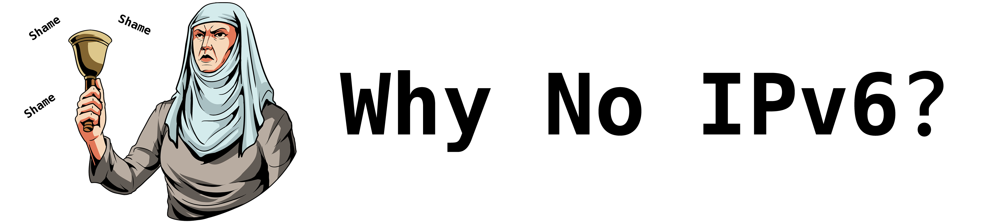

 

  <picture>
    <source media="(prefers-color-scheme: dark)" srcset=".github/images/Github-logo-white.png">
    
  </picture>

 

<h1 align="center">Shame as a Service</h1>

Shaming the largest websites in the world lacking IPv6 support.

 

    <a href="https://github.com/lasseh/whynoipv6/issues/new?assignees=lasseh&labels=bug&projects=&template=bug_report.md&title=%F0%9F%90%9B+Bug+Report%3A+">Report Bug</a>
    ·
    <a href="https://github.com/lasseh/whynoipv6/issues/new?assignees=lasseh&labels=enhancement&projects=&template=feature_request.md&title=%F0%9F%9A%80+Feature%3A+">Request Feature</a>
    ·
    <a href="https://twitter.com/WhyNoIPv6">Twitter</a>
  

## What is WhyNoIPv6.com?

WhyNoIPv6.com is a public, anonymous measurement service that answers, for the world's
most-visited websites, *"does this site work over IPv6 — and if not, why not?"* It crawls
the Tranco top 1,000,000 domains plus community-submitted campaign lists every day,
measures IPv6 support across DNS, web, mail, and nameserver infrastructure, and publishes
the results as public Heroes vs. Sinners leaderboards by domain, country, and network.

## Why is IPv6 important?

IPv6 is not merely an upgrade; it's a fundamental pillar for the Internet's sustainable
future. As we edge closer to exhausting the IPv4 address space, the immense address
capacity of IPv6 becomes indispensable. Beyond scalability, IPv6 brings robust security
protocols and superior performance, making it the linchpin for modern, efficient, and
secure internet communications.

Failing to adopt IPv6 is tantamount to inhibiting the Internet's evolution. For top
websites this isn't just negligence — it's an abdication of their role as industry
leaders. Our mission is not just to monitor, but to actively push for the closing of
these alarming gaps in IPv6 adoption.

## How does it work?

Every scannable domain is checked **once per day** by the crawler:

- **What is checked:** IPv6 (AAAA) records for the apex domain and `www`, nameservers
  (NS), mail (MX), plus DNSSEC, SPF/PTR diagnostics, and whether the site's page
  resources (scripts, images, CSS) are loadable over IPv6.
- **Trust before publish:** the two classification-critical lookups (apex and `www`)
  are resolved through three public resolvers concurrently with a 2-of-3 quorum;
  everything else goes through local Unbound recursors. A domain's public status only
  changes after the new value has held for several consecutive daily scans — one flaky
  DNS response never flips a status.
- **The ladder:** from the confirmed statuses each domain is deterministically
  classified as **hero / partial / sinner / inactive** — no scores, no letter grades.
  Domains that also serve every page resource over IPv6 reach the **saint** tier.

## Tranco?

The [Tranco List](https://tranco-list.eu/) offers a research-grade way to rank the
most-visited websites on the internet. It aggregates data from multiple sources into
a manipulation-resistant top list, addressing the accuracy concerns associated with
older rankings like Alexa. WhyNoIPv6 scans the Tranco top 1,000,000 pay-level domains.

## Campaigns

In addition to the top 1 million domains, WhyNoIPv6.com has a campaign feature for
community-curated lists — banks, governments, ISPs of a given country — so anyone can
track and shame a domain set they care about. Campaigns are plain YAML files managed
via pull request: [whynoipv6-campaign](https://github.com/lasseh/whynoipv6-campaign).

## The stack

One monorepo, three moving parts:

| Part | What it is |
| --- | --- |
| [`backend/`](backend/) | One Go module, three binaries: `api` (public HTTP API), `crawler` (autonomous scanning daemon), `v6ctl` (operator CLI) — over PostgreSQL + TimescaleDB |
| [`frontend/`](frontend/) | Vue 3 + TypeScript + Tailwind app for [whynoipv6.com](https://whynoipv6.com) |
| [`openapi/`](openapi/) | The OpenAPI 3 contract both sides are generated against — [api.whynoipv6.com](https://api.whynoipv6.com) |

- **[docs/architecture.md](docs/architecture.md)** — how the system fits together
- **[docs/deploy.md](docs/deploy.md)** — run it locally with Docker, deploy it for real
- **[docs/internals.md](docs/internals.md)** — a tour of the codebase
- **[docs/spec/](docs/spec/)** — the full build spec (normative)

## Contributing

Contributions welcome — see [CONTRIBUTING.md](CONTRIBUTING.md) to get the local
stack running and [SECURITY.md](SECURITY.md) for reporting vulnerabilities.

## License

The code is licensed under [GPL-3.0](LICENSE). The published measurement data
served by the API is licensed
[CC-BY-NC-4.0](https://creativecommons.org/licenses/by-nc/4.0/).

## Contributors

