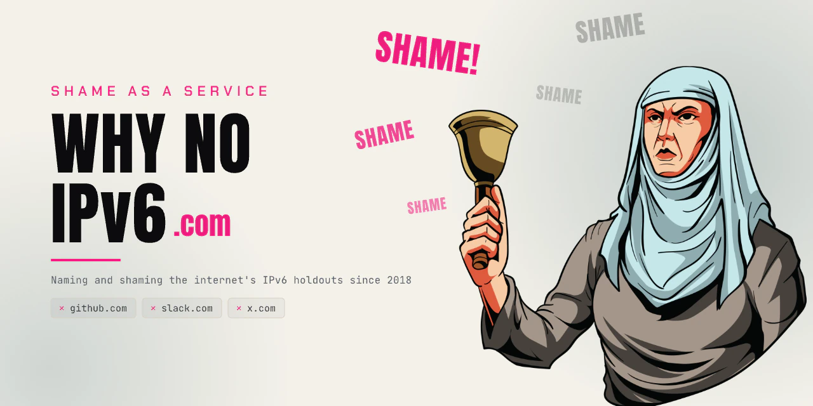
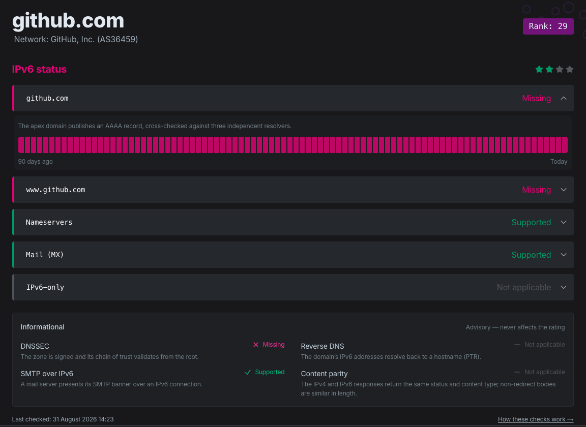

 

  <picture>
    <source media="(prefers-color-scheme: dark)" srcset=".github/images/github-logo-dark.webp">
    
  </picture>

 

 

    <a href="https://github.com/lasseh/whynoipv6/issues/new?assignees=lasseh&labels=bug&projects=&template=bug_report.md&title=%F0%9F%90%9B+Bug+Report%3A+">Report Bug</a>
    ·
    <a href="https://github.com/lasseh/whynoipv6/issues/new?assignees=lasseh&labels=enhancement&projects=&template=feature_request.md&title=%F0%9F%9A%80+Feature%3A+">Request Feature</a>
    ·
    <a href="https://whynoipv6.com">whynoipv6.com</a>
  

## What is WhyNoIPv6.com?

WhyNoIPv6.com checks whether popular domains work over IPv6 and explains what is
missing when they do not. The results are public and require no account.

The crawler checks domains from Tranco's top-million ranking and
community-maintained campaigns. It tests websites, authoritative DNS, and mail
infrastructure. The site publishes domain tier lists and tracks adoption by country,
network, provider, and campaign.

  

## Why is IPv6 important?

The free pools of IPv4 addresses are exhausted. New services now depend on address
sharing, address transfers, or other workarounds. IPv6 removes that address shortage.

IPv6 is neither new nor experimental. The first Standards Track specification was
published in 1998, and World IPv6 Launch took place in 2012. Major access networks,
cloud providers, and content platforms have supported IPv6 for years. Popular websites
that still lack it have left the job unfinished. WhyNoIPv6 tracks that gap and names
names.

## How does it work?

The crawler normally checks active domains every 24 hours.

- **Coverage.** It checks the apex domain, `www`, authoritative nameservers, and mail
  servers for IPv6 records. It also connects to the website over IPv6. Other checks cover
  DNSSEC, SPF, PTR, SMTP, TLS, response parity, and latency. For reachable sites, the
  crawler finds external resource hosts and checks their IPv6 records. It does not
  download and test every resource on every page.
- **DNS consensus.** Checks for the apex domain and `www` normally query three public DNS
  resolvers. At least two must return the same answer. Once the crawler has established a
  result, a new result must appear repeatedly before the public status changes. A failed
  check or one disagreeing resolver cannot overwrite an established status.
- **Tiers.** Confirmed results place each domain in the **hero**, **partial**, **sinner**,
  or **inactive** tier. A domain remains **unknown** until the crawler has enough evidence
  to classify it. There are no numeric scores or letter grades. A hero becomes a
  **saint** when none of its detected external resource hosts are IPv4-only.

## What is Tranco?

[Tranco](https://tranco-list.eu/) ranks popular domains for research. It combines several
data sources and includes safeguards against the manipulation that affected older
rankings such as Alexa. WhyNoIPv6 uses Tranco's standard top-million list. The ranking
measures popularity, not exact traffic.

## Campaigns

Campaigns track related domains, such as banks, government websites, or ISPs within a
country. They bring domains outside the Tranco list into view and let communities shame
the ones they care about.

Campaign definitions are YAML files in the separate
[whynoipv6-campaign](https://github.com/lasseh/whynoipv6-campaign) repository. Follow that
repository's contribution guide to submit one.

## The stack

The monorepo has three main source areas:

| Part | What it is |
| --- | --- |
| [`backend/`](backend/) | A Go module containing `api` (public HTTP API), `crawler` (scanning daemon), and `v6ctl` (operator CLI), backed by PostgreSQL and TimescaleDB |
| [`frontend/`](frontend/) | Vue 3 + TypeScript + Tailwind app for [whynoipv6.com](https://whynoipv6.com) |
| [`openapi/`](openapi/) | The OpenAPI 3 contract used to generate Go models and frontend TypeScript types for [api.whynoipv6.com](https://api.whynoipv6.com) |

- **[docs/architecture.md](docs/architecture.md)** — how the system fits together
- **[docs/deploy.md](docs/deploy.md)** — run it locally with Docker, deploy it for real
- **[docs/internals.md](docs/internals.md)** — a tour of the codebase
- **[docs/spec/](docs/spec/)** — the frozen build specification; later decisions live in [docs/adr/](docs/adr/)

## Contributing

Contributions are welcome. See [CONTRIBUTING.md](CONTRIBUTING.md) to run the local stack
and [SECURITY.md](SECURITY.md) to report vulnerabilities.

## License

The code is licensed under [GPL-3.0](LICENSE). WhyNoIPv6 measurement data is published
under [CC-BY-NC-4.0](https://creativecommons.org/licenses/by-nc/4.0/). Data imported or
derived from third-party sources remains subject to the source's terms and attribution
requirements.

## Contributors

