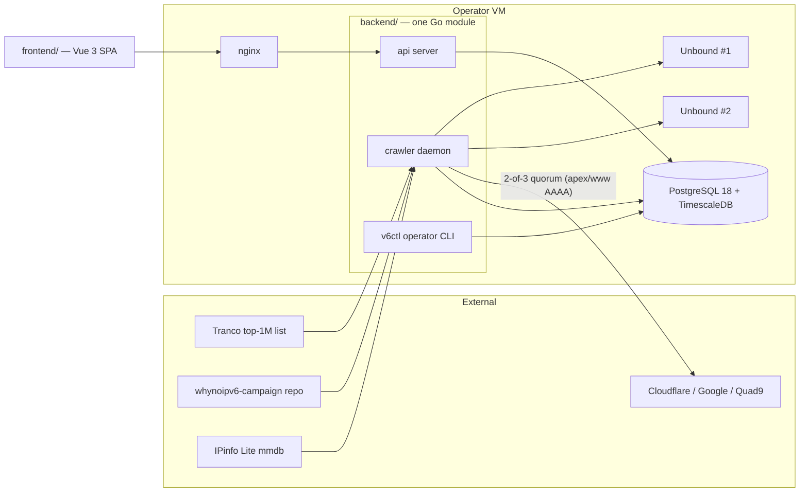

# Architecture

How WhyNoIPv6 fits together. This is the orientation doc — the normative build spec
lives in [`spec/`](spec/), the code-level tour in [`internals.md`](internals.md), and
the operational side in [`deploy.md`](deploy.md).

## The system in one paragraph

WhyNoIPv6 is a public, anonymous measurement service: it scans the Tranco top
1,000,000 domains (plus community campaign lists) once per day each, records raw
observations append-only in TimescaleDB, promotes a status change to the public site
only after it has been **quorum-checked and held for several consecutive daily
scans**, and serves the confirmed model through a versionless, OpenAPI-first,
read-only HTTP API that a Vue 3 frontend renders. No accounts, no scores, no queues —
one Go module, three binaries, one Postgres.

## Components



- **`crawler`** — the autonomous scanning daemon. Claims due domains from the
  frontier, runs the 15-check engine against each, commits observations and confirmed
  transitions, and runs the daily housekeeping tick and Tranco import on internal
  schedules. It needs working IPv6 egress (it self-checks before claiming work).
- **`api`** — the public read surface at `api.whynoipv6.com`. Versionless root paths
  (`/domains`, `/heroes`, `/sinners`, `/saints`, `/countries`, `/campaigns`, …),
  keyset pagination, RFC 9457 `problem+json` errors, `snake_case` wire. The only
  write path is `POST /check` (an async, rate-limited live re-check job).
- **`v6ctl`** — the operator CLI. Every operator action is a `v6ctl` verb with direct
  DB access — there is no admin HTTP surface. Migrations, Tranco import, campaign
  sync, GeoIP refresh, dataset export, shame-list curation, lifecycle overrides.
- **PostgreSQL 18 + TimescaleDB** — the only datastore. Raw scans, per-scan details,
  the changelog, and crawler metrics are hypertables with retention policies; the
  `domain` table doubles as the work queue (see below).
- **Unbound ×2** — local recursive resolvers that absorb the bulk DNS load
  (NS/MX/PTR/DNSSEC and everything not classification-critical).
- **frontend** — a Vue 3.5 + TypeScript + Tailwind v4 SPA, built against the same
  OpenAPI contract as the backend, deployed as static files behind nginx.

## The crawl → confirm → publish pipeline

This is the heart of the system, and the reason the public data is trustworthy.

**1. The table is the frontier.** Every scannable host is one row in `domain` with a
`next_check_at`. Crawler workers claim due rows with `FOR UPDATE SKIP LOCKED` and a
30-minute lease — there is no queue, no broker, and no in-memory list of due work
(the failure mode that killed both prior schedulers). Each domain is scanned once per
day no matter how many lists it appears on.

**2. Measure with appropriate paranoia.** The two lookups that decide a domain's
public fate — apex AAAA and `www` AAAA — are resolved through three public resolvers
concurrently and must agree 2-of-3 (with per-provider circuit breakers and rate
caps). Everything else goes through the local Unbounds. HTTP/TLS checks dial through
an SSRF-pinned dialer that only ever connects to the addresses DNS actually returned.

**3. Observe ≠ publish.** A scan produces 7-valued internal *observations*
(`supported | unsupported | no_record | not_applicable | partial | error |
inconsistent`). Raw observations land append-only in the `scan` hypertable. A
dimension's public 4-valued status advances only when the newly observed value is
definitive **and has held for N consecutive daily scans** (N=2 for base/www/ns/mx,
N=3 for the derived conn/resources dimensions). Only a confirmed transition writes a
`changelog` row — so the changelog is a feed of real events, not DNS noise.

**4. Deterministic classification, no scores.** From the six confirmed dimension
statuses a first-match ladder computes the public classification: **hero / partial /
sinner / inactive** (plus **saint** — a hero whose page resources all load over
IPv6). There is no numeric score or letter grade anywhere in the system.

**5. Publish.** The API serves the confirmed model directly: per-dimension
`{value, since}` status objects, tier collections, per-country/ASN/campaign
aggregates, Atom/JSON feeds, SVG badges, and nightly static dataset snapshots
(CSV.gz + Parquet) for bulk consumers.

## Contract-first API

`openapi/openapi.yaml` is the single contract. From it:

- `oapi-codegen` generates the Go server types and chi bindings
  (`backend/internal/api/gen/`),
- `openapi-typescript` generates the frontend's wire types (`openapi/schema.ts`),
- Spectral lints the spec itself (snake_case, envelope shapes, problem+json),
- `make generate` is a CI drift gate: if regenerating changes the tree, CI fails.

Neither side hand-writes wire shapes; a contract change is one YAML edit plus
regeneration on both sides.

## Layering (backend)

Hexagonal, dependency arrows pointing inward:

```
cmd/{api,crawler,v6ctl}          process wiring only
  internal/api  internal/crawler  internal/ingest ...   adapters & orchestration
    internal/observe             the neutral engine↔consumer seam
      internal/checker           the 15-check scan engine (lifted from v6audit)
        internal/domain          pure vocabulary: enums, Canonicalize, the ladder
```

`internal/domain` sits at the bottom of the import graph — it imports no other
`internal/` package, depends on nothing outside the stdlib but
`golang.org/x/net` (idna, publicsuffix), and mirrors the DB enums — every
layer speaks its types. The API never imports the crawler; both meet only in
`observe`, which guarantees a live re-check and a stored scan map to identical public
shapes. See [`internals.md`](internals.md) for the full package map.

## Singleton coordination without a scheduler

Both crawler processes (when more than one runs) execute identical internal
schedules — the 03:30 UTC daily tick and the 23:15 UTC Tranco import — and Postgres
advisory locks (`internal/lock`, class 60660) ensure each job runs exactly once.
Operator-triggered jobs (`v6ctl export`, `campaign sync`) take the same locks, so a
manual run can never race the scheduled one.

## Data lifecycle

| Data | Table(s) | Kept |
| --- | --- | --- |
| Raw per-scan observations | `scan` (hypertable) | 2 years |
| Typed per-check detail JSON | `scan_detail` (hypertable) | 90 days |
| Confirmed public transitions | `changelog` (hypertable) | forever |
| Crawler/resolver telemetry | `crawler_metrics`, `unbound_stats` | 90 / 30 days |
| Daily aggregates | `stats_*_daily` | forever |
| Current public state | `domain` (one row per host) | current |

History is never mutated; the current state is always recomputable from the pipeline
going forward (the cutover deliberately imported no legacy history — see
[ADR index](adr/) and [`runbooks/cutover.md`](runbooks/cutover.md)).

## Design decisions worth knowing

- **No queue/broker/scheduler** — the frontier is a DB column + `SKIP LOCKED`
  (River/Redis/NATS explicitly rejected).
- **Anti-flap over freshness** — the public site is deliberately a day or two behind
  reality for a status change; in exchange it essentially never flip-flops.
- **Tranco-only** — the single ranked-list source; campaigns are the only other
  ingest, and they are YAML-in-git, synced idempotently.
- **GeoIP is IPinfo Lite** — country/ASN attribution reads a local
  `ipinfo_lite.mmdb` with hourly hot-reload ([ADR 0001](adr/0001-geoip-ipinfo-lite.md)).
- **Saints, no almost/mail tiers** — the tier model is sinner/hero/saint
  ([ADR 0003](adr/0003-saints-rename-tier-pruning.md)); the conn/resources derived
  dimensions are folded per [ADR 0002](adr/0002-ipv6-only-fold.md).
